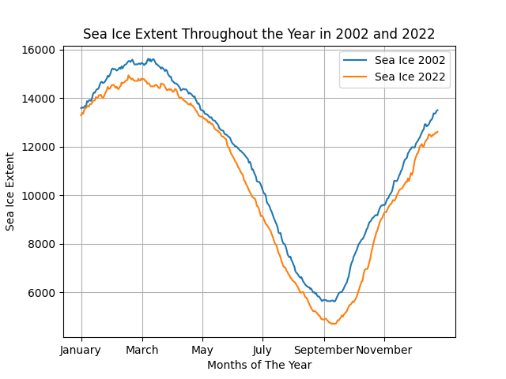
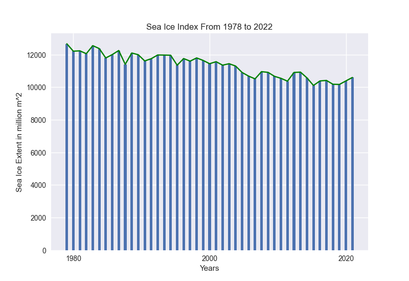
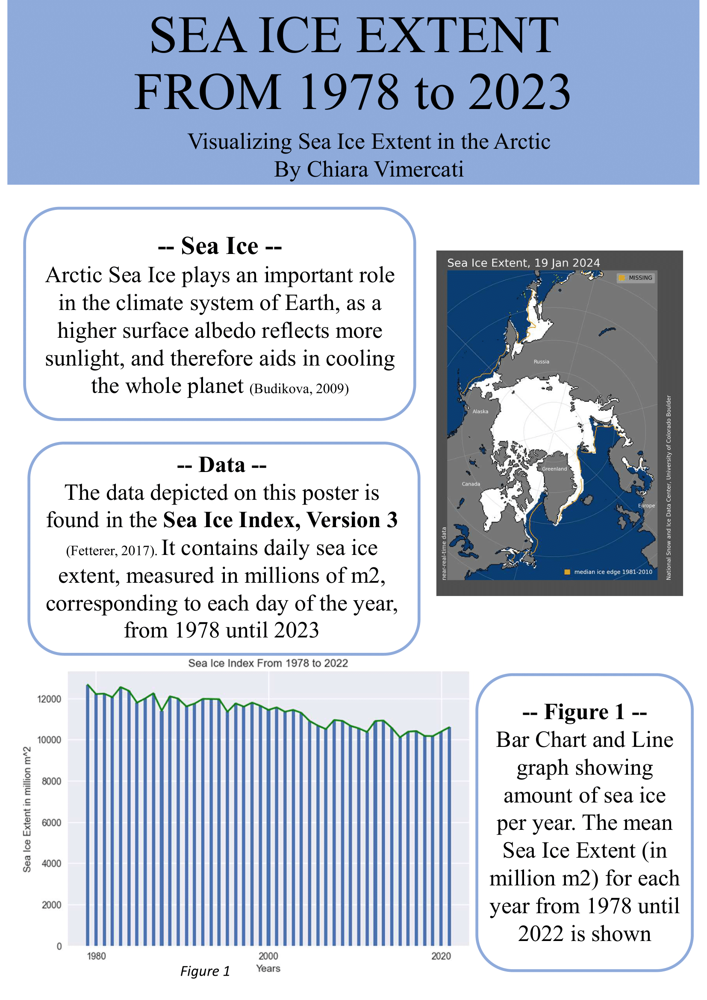
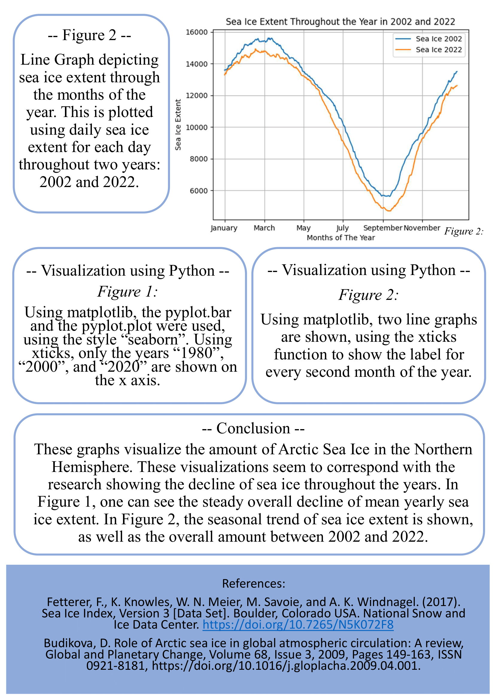

# Sea_Ice_Extent
Analysis of Sea Ice extent from 1978 to 2022. Monthly visualisation of Sea Ice extent for 2002 and 2022.

## Project Overview
This project analyses Sea Ice Extent. The data is taken from the National Snow and Ice Data Center, using their publicly available "Sea Ice Index, Version 3" dataset. 

## Description of Project
This project handles sea ice data from the National Snow and Data Center, and presents it to show the average yearly Sea Ice extent from 1978 to 2022. For a more in-depth analysis, showing the seasonal change, further analysis shows the yearly amount of sea ice in 2002 and 2022. 

#Seasonal Sea Ice Extent (2002 vs 2022)

#Yearly Average Sea Ice Extent (1978 - 2022)

## Project Poster
For a simple poster presentation for the project, including further information on data analysis, check out the project poster: 
### Page 1 

### Page 2

## Skills 

- Data Cleaning and Preparation
- Time Series Analysis
- Data Visualisation with Matplotlib, Seaborn (Python)
- Environmental Data

